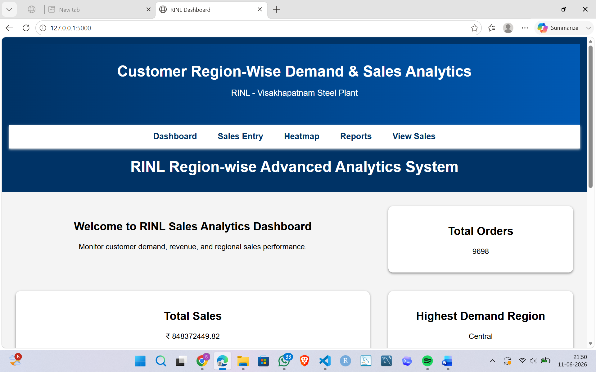
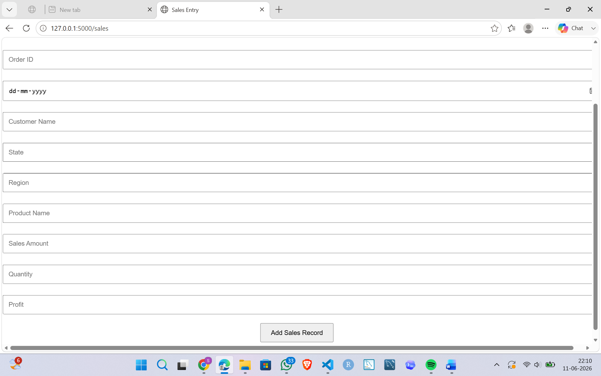
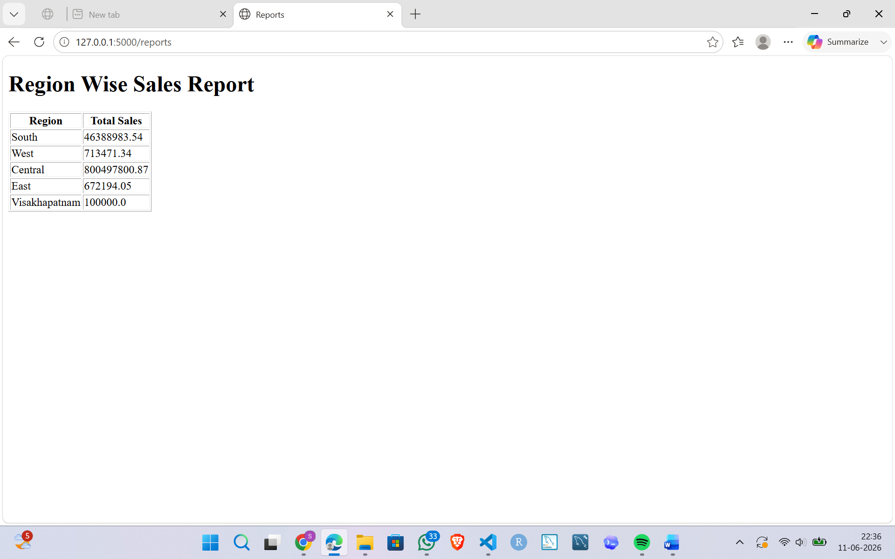
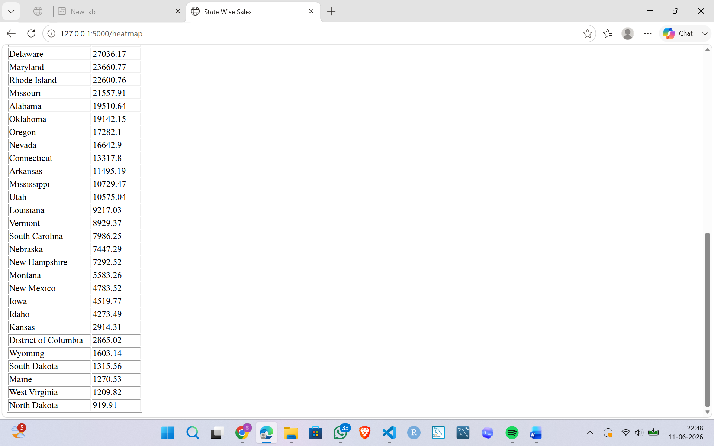

# Customer Region-Wise Demand & Sales Analytics System for RINL

## 📌 Overview

The **Customer Region-Wise Demand & Sales Analytics System** is a web-based application developed during my internship at **RINL – Visakhapatnam Steel Plant (IT & ERP Department)**.

The system helps analyze customer demand and sales performance across different regions by providing interactive dashboards, reports, and visualizations for better business decision-making.

---

## ✨ Features

- 📊 Interactive Sales Dashboard
- 📈 Region-wise Sales Analytics
- 🌍 State-wise Demand Analysis
- 📝 Sales Entry & Management
- 🔍 Search and View Sales Records
- 📋 Reports Generation
- 🔥 Heatmap Visualization
- 📊 Charts using Chart.js

---

## 🛠️ Technologies Used

### Frontend
- HTML
- CSS
- JavaScript
- Chart.js

### Backend
- Python
- Flask

### Database
- MySQL

---

## 📂 Project Modules

- Dashboard
- Sales Entry
- Region-wise Analytics
- Reports
- Heatmap
- View Sales
- Edit Sales

---

## 📷 Screenshots

*(Screenshots will be added soon.)*

---

## 🚀 Future Enhancements

- User Authentication
- Export Reports to PDF/Excel
- Machine Learning-based Demand Forecasting
- Advanced Business Analytics
- Interactive Maps

---

## 👩‍💻 Author

**Sireesha Manthrabuddi**

B.Tech – Data Science  
MVGR College of Engineering

- GitHub: https://github.com/sireesha-4106
- LinkedIn: https://www.linkedin.com/in/manthrabuddi-sireesha-9b0a67319/

---

## 📷 Screenshots

### Dashboard

### Sales Entry

### Reports

### Heatmap

### Region-wise Sales

## ⭐ Acknowledgement

This project was developed as part of my internship at **RINL – Visakhapatnam Steel Plant (IT & ERP Department)**.
